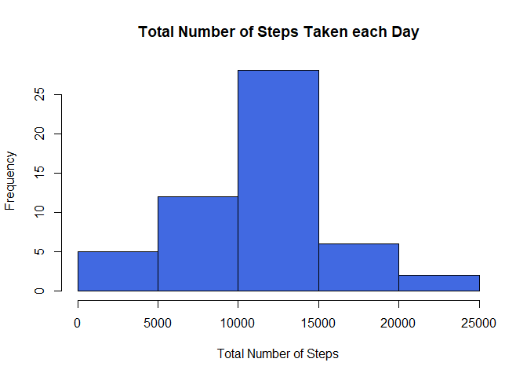
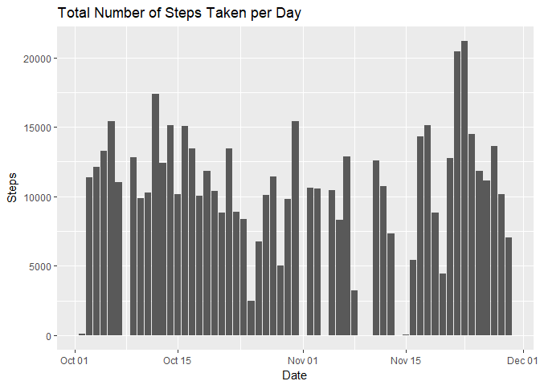
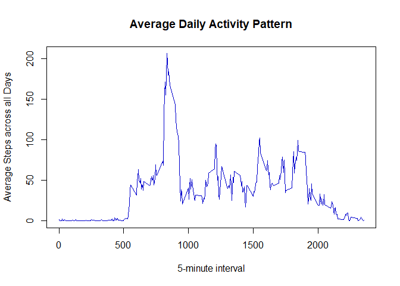
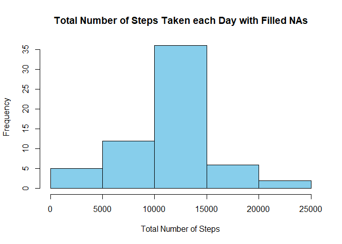
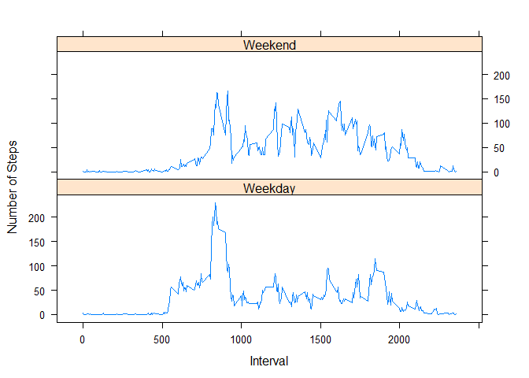

##Setting Global Options


## Loading and preprocessing the data


```r
       data<-read.csv(unz("activity.zip","activity.csv"), header=T,sep=",")
        head(data)
```

```
##   steps       date interval
## 1    NA 2012-10-01        0
## 2    NA 2012-10-01        5
## 3    NA 2012-10-01       10
## 4    NA 2012-10-01       15
## 5    NA 2012-10-01       20
## 6    NA 2012-10-01       25
```

```r
        data$date<-as.Date(data$date)
```

## What is mean total number of steps taken per day?

```r
        #aggregate number of steps per day
        ag_data<-setNames(aggregate(data$steps, by=list(data$date), sum, na.omit=T),c("Date","Steps"))
       
        #A histogram of total number of steps taken each day
        hist(ag_data$Steps, main="Total Number of Steps Taken each Day", xlab="Total Number of Steps", 
             col="royalblue")
```

<!-- -->

```r
        #A histogram of total number of steps per each day
        ggplot(na.omit(ag_data),aes(Date, Steps))+ geom_histogram(stat = "identity")  + 
                ggtitle("Total Number of Steps Taken per Day" )
```

```
## Warning: Ignoring unknown parameters: binwidth, bins, pad
```

<!-- -->

```r
         #mean total number of steps
       meansteps<- mean(ag_data[,2], na.rm=T)
        #median number of steps
       mediansteps<- median(ag_data[,2], na.rm=T)
```
The mean total number of steps taken per day is **10767**
The median total number of steps taken per day is **10766**

## What is the average daily activity pattern?

```r
        #compute average steps per interval
        pattern<- tapply(data$steps,data$interval, mean,na.rm=T)
        
        #Make timeseries Plot
        plot(row.names(pattern), pattern, type = "l", xlab = "5-minute interval", 
             ylab = "Average Steps across all Days", 
              main = "Average Daily Activity Pattern", col = "mediumblue")
```

<!-- -->

```r
        #Which 5-minute interval, contains the maximum number of steps?
        maxsteps<-names(which(pattern ==max(pattern)))
```
The **835**, 5-minute interval, on average across all the days in the dataset, contains the maximum number of steps

## Imputing missing values

```r
        #Calculate the total number of missing values in the dataset (i.e. the total number of rows with NAs)
        Numnadata <- nrow(data[!complete.cases(data),])
        
        #crate a copy of the activity dataset
        filldata<-data
        
        #get indices of na data
        nadata<-which(is.na(filldata))
        
        #fill na vslues with mean number steps for the corresponding interval
        for(i in 1 : Numnadata)
        {
                index<-nadata[i]
                filldata$steps[index]<-pattern[as.character(filldata$interval[index])]
        }
          #aggregate number of steps per day of filled data
        ag_filldata<-setNames(aggregate(filldata$steps, by=list(filldata$date), sum, na.omit=T),
                              c("Date","Steps"))
       
        #A histogram of total number of steps taken each day
        hist(ag_filldata$Steps, main="Total Number of Steps Taken each Day with Filled NAs", 
             xlab="Total Number of Steps",  col="Skyblue")
```

<!-- -->

```r
         #mean total number of steps withfilled na
       meansteps_na<- mean(ag_filldata[,2], na.rm=T)
        #median number of steps
       mediansteps_na<- median(ag_filldata[,2], na.rm=T)
```
- The total number of missing values in the dataset is **2304 **
- The mean total number of steps taken per day imputted na values is **10767**
- The median total number of steps taken per day with imputted na values is **10767**

## Are there differences in activity patterns between weekdays and weekends?


```r
        day<- weekdays(filldata$date)
        filldata$daylevel<-ifelse(day == "Saturday" | day == "Sunday", "Weekend", "Weekday")
        head(filldata)
```

```
##       steps       date interval daylevel
## 1 1.7169811 2012-10-01        0  Weekday
## 2 0.3396226 2012-10-01        5  Weekday
## 3 0.1320755 2012-10-01       10  Weekday
## 4 0.1509434 2012-10-01       15  Weekday
## 5 0.0754717 2012-10-01       20  Weekday
## 6 2.0943396 2012-10-01       25  Weekday
```

```r
        fillpattern<- aggregate(filldata$steps, by = list(filldata$interval, filldata$daylevel), 
        mean)
        names(fillpattern) <- c("interval", "daylevel", "steps")
        xyplot(steps ~ interval | daylevel, fillpattern, type = "l", layout = c(1, 2), 
    xlab = "Interval", ylab = "Number of Steps")
```

<!-- -->
